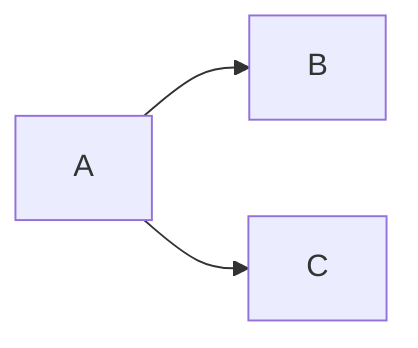
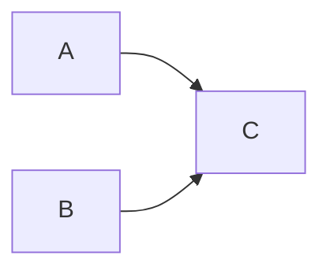

# Types de jonction dans les diagrammes causaux

## Chain

[[@pearl2016]]

> **Rule 1 (Conditional Independence in Chains)** Two variables, $X$ and $Y$, are conditionally independent given $Z$, if there is only one unidirectional path between $X$ and $Y$ and $Z$ is any set of variables that intercepts that paths.
> p. 39

## Fork

> **Rule 2 (Conditional independence in forks)** If a variable $X$ is a common cause of variables $Y$ and $Z$, and there is only one path between $Y$ and $X$, the $Y$ and $Z$ are independent conditional on $X$.
> p. 40

## Collider

Monty Hall Problem

> **Rule 3 (Conditional independence in Colliders)** If a variable $Z$ is the collision node between two variables $X$ and $Y$, and there is only one path between $X$ and $Y$, then $X$ and $Y$ are unconditionally independent but are dependent contional on $Z$ and any descendants of $Z$.
> p. 44

#causalité #diagramme