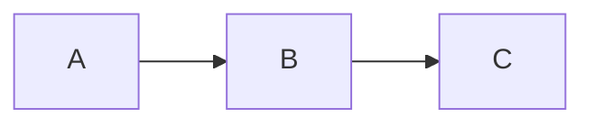
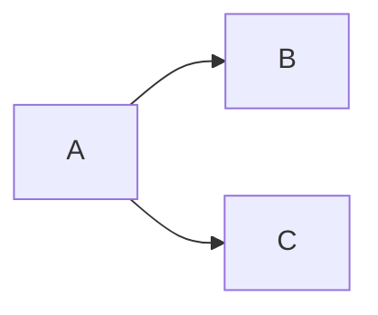
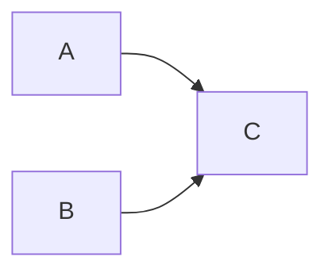

# Types de jonction dans les diagrammes causaux

## Chain

```mermaid
graph LR;
	A --> B --> C;
```

## Fork

```mermaid
graph LR
	A --> B;
	A --> C;
```

## Collider

```mermaid
graph LR
	A --> C
	B --> C
```

